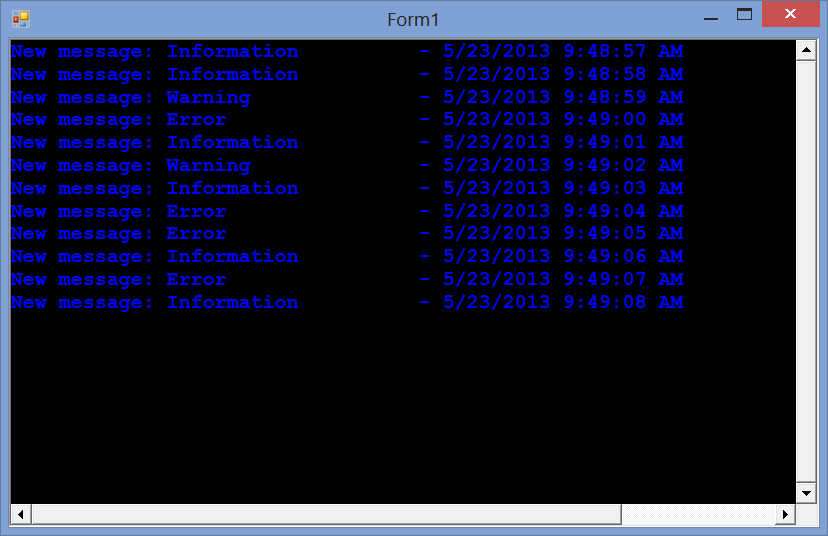

<!-- default badges list -->

<!-- default badges end -->

# Rich Text Editor for WinForms - How to Create a Log Viewer Application

This example illustrates how to use RichEditControl in a "Log Viewer"-like application. 

## Implementation Details

First, adjust the default view settings in the form's constructor and default document settings in the [RichEditControl.DocumentLoaded](https://docs.devexpress.com/WindowsForms/DevExpress.XtraRichEdit.RichEditControl.DocumentLoaded)  / [RichEditControl.EmptyDocumentCreated](https://docs.devexpress.com/WindowsForms/DevExpress.XtraRichEdit.RichEditControl.EmptyDocumentCreated) event handlers, correspondingly. 

Then, use the [SubDocument.AppendText](https://docs.devexpress.com/OfficeFileAPI/DevExpress.XtraRichEdit.API.Native.SubDocument.AppendText(System.String))  method to append a new message to the RichEditControl.

## Files to Review

* [Form1.cs](./CS/Form1.cs) (VB: [Form1.vb](./VB/Form1.vb))
* [Program.cs](./CS/Program.cs) (VB: [Program.vb](./VB/Program.vb))

<!-- feedback -->
## Does this example address your development requirements/objectives?

 

(you will be redirected to DevExpress.com to submit your response)
<!-- feedback end -->
